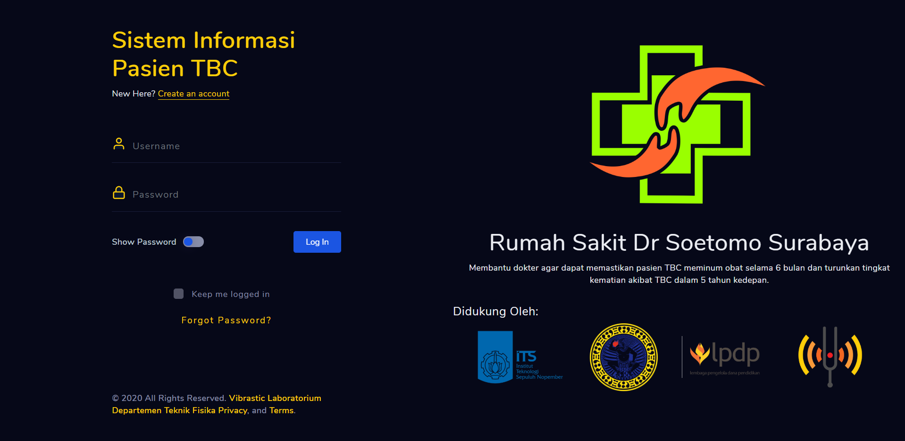

# Universal Covid-19 Dashboard

Dashboard monitoring dan reporting untuk persiapan pandemi covid-19.

## Sistem ini support:
1. Status Pasien.
2. Report kebutuhan Pasien.
3. Telemedicine Pasien dan Dokter.
4. lainnya.

### Login Page


### Dashboard


### Custom Logo


## Dokumentasi

Dashboard ini menggunakan Mapbox: https://www.mapbox.com/
Silahkan generate API key anda-anda sekalian untuk menggunakan fitur map di dashboard ini.

## Cara Installasi

Download node.js terlebih dahulu.

```
git clone https://github.com/SangsakaWira/Universal-Covid-19-Dashboard.git
cd Universal-Covid-19-Dashboard
npm install
```

Cara Menjalankan: 

```
node server.js
```