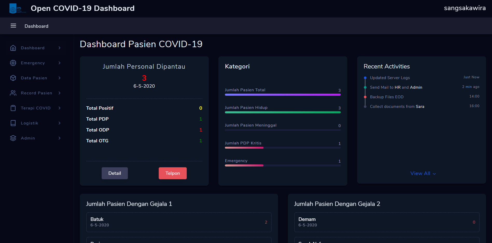

# Open Covid-19 Dashboard

Dashboard monitoring dan reporting untuk persiapan pandemi covid-19. Digunakan
untuk rumah sakit, puskesmas, kantor dan instansi lainnya yang ingin melakukan
tracking kondisi kesehatan pasien/pegawai dan melakukan pencegahan.

## Sistem ini support:
1. Status Pasien.
2. Report kebutuhan Pasien.
3. Telemedicine Pasien dan Dokter.
4. lainnya.

### Login Page


### Dashboard Page



## Dokumentasi

Dashboard ini menggunakan Mapbox: https://www.mapbox.com/
Silahkan generate API key anda-anda sekalian untuk menggunakan fitur map di dashboard ini.

## Cara Installasi

Download node.js terlebih dahulu.

```
git clone https://github.com/SangsakaWira/Universal-Covid-19-Dashboard.git
cd Open-Covid-19-Dashboard
npm install
```
Buat file .env dan contoh isi file:

```
API_KEY=secretkeydarimapbox
PORT=4500
HOST_PRODUK=http://covid-dashboard-its
HOST_DEV=http://localhost:3000
HOST=http://covid-dashboard-its.id
MODE=COVID
```

Cara Menjalankan: 

```
node server.js
```